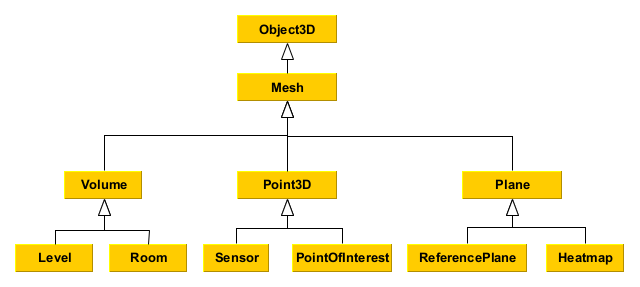

# Frontend overview

The application is built with [SvelteKit](https://kit.svelte.dev/) framework with the main component using [three.js](https://threejs.org/) library to create and render 3D graphics in a web browser using WebGL.

The image below shows the inheritance diagram for the main objects in the 3D scene/viewer, representing SiteVisor's model.

[Object3D](https://threejs.org/docs/#api/en/core/Object3D) and [Mesh](https://threejs.org/docs/#api/en/objects/Mesh) are three.js classes and provide a base for the SiteVisor objects.

SiteVisor introduces custom objects extending three.js classes. These are: `Volume`, `Point3D` and `Plane`, which all inherit from three.js Mesh class.
These three objects should provide a solid basis to visualise SiteVisor's model to the user. All other objects in the scene will inherit from them.

Below is a short description of SiteVisor's objects in the 3D scene:

- `Level` - represents a condignation of a building encompassing rooms.
- `Room` - an individual room in a building.
- `Sensor` - representation of a physical sensor on site.
- `PointOfInterest` - any point of interest marked by the user. Can be an item for maintenance etc.
- `ReferencePlane` - a base plane in the 3D model represented by a helper grid, used as a reference to place objects in the 3D space.
- `Heatmap` - textured plane showing a heatmap produced by interpolating data from multiple sensors. For example, temperature across the building.