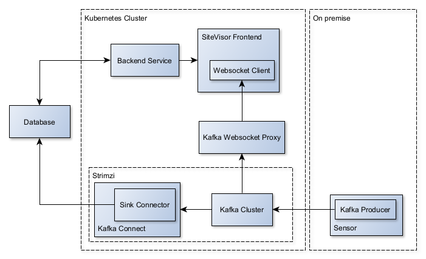

# Architecture Overview

The diagram below shows the general project architecture, from data perspective, in its minimal form. There could be further extensions added including more data stream types available as inputs. For example MQTT Clients through [MQTT bridge](https://github.com/strimzi/strimzi-mqtt-bridge) or HTTP Clients through [Kafka Bridge](https://strimzi.io/docs/operators/latest/overview#overview-components-kafka-bridge_str).

[Apache Kafka](https://kafka.apache.org/) is at the core of the project. This Kafka cluster is deployed and managed by [Strimzi](https://strimzi.io/) operator.

## Realtime data stream

The application is meant to provide users with a Digital Twin backed by realtime data. For this reason Kafka was chosen as the main technology for communication. 

To achieve the realtime delivery to the browser, [Kafka Websocket Proxy](https://kpmeen.gitlab.io/kafka-websocket-proxy/) is used as a bridge between Kafka Cluster and a Websocket Client in the frontend of SiteVisor application.

## Data persistence

The sensor data needs to be stored in a database, from where it can be accessed by the SiteVisor backend service. This wil be used to produce various analytics presented to the users in a form of charts or heatmaps etc.
