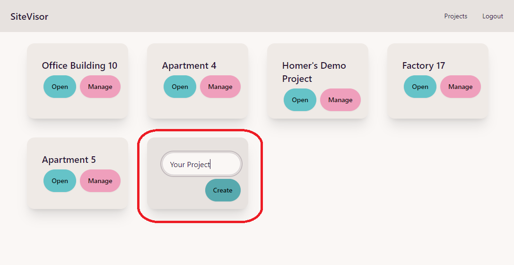
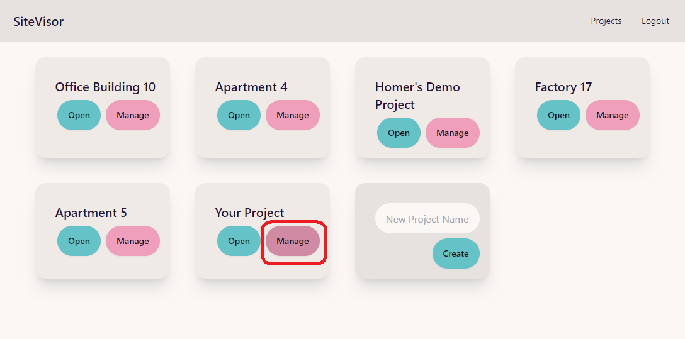
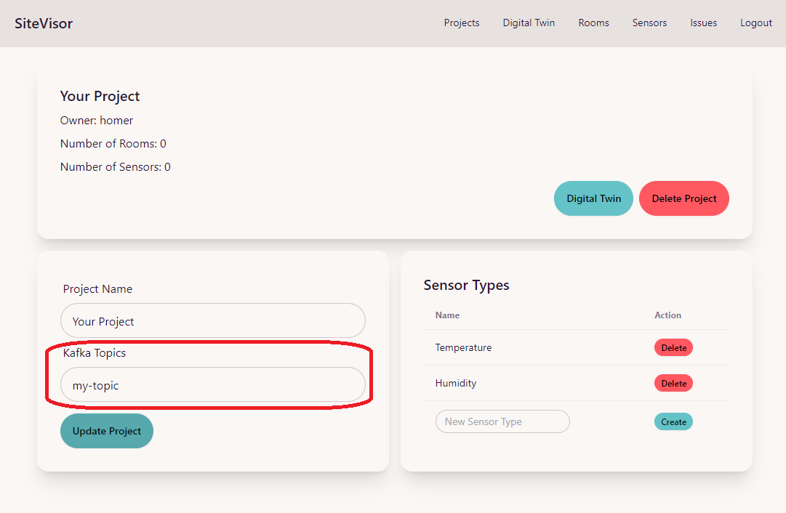

# Project Management
This guide describes Project management in SiteVisor.

## Create a new Project
Directly after loggin in, you are presented with a list of your projects.
Use the last card on the list to enter the name of your new project and approve with `Create` button.



After that you should see a new card added with the name of your project.

## Configure Project
At any time you can change the configuration of your projects by using the `Manage` button.



This brings us to the Project management page.


### Kafka Topics
The most important configuration are `Kafka Topics`. This field is used to input names of Kafka topics to which we would like to establish connection in our Project.

We can list as many topics as we wish. Each topic name should be separated by a comma, for example:
```
my-topic,datastream42,env-data
```
would establish connections to three topics:
- my-topic
- datastream42
- env-data



### Sensor Types

Notice the `Sensor Types` section. Two types of sensors are added to each project by default: `Temperature` and `Humidity`. You can add a new type or delete any type as you wish. The types are used to filter the sensors in Sensor listing pages and the sensor data Heatmap.